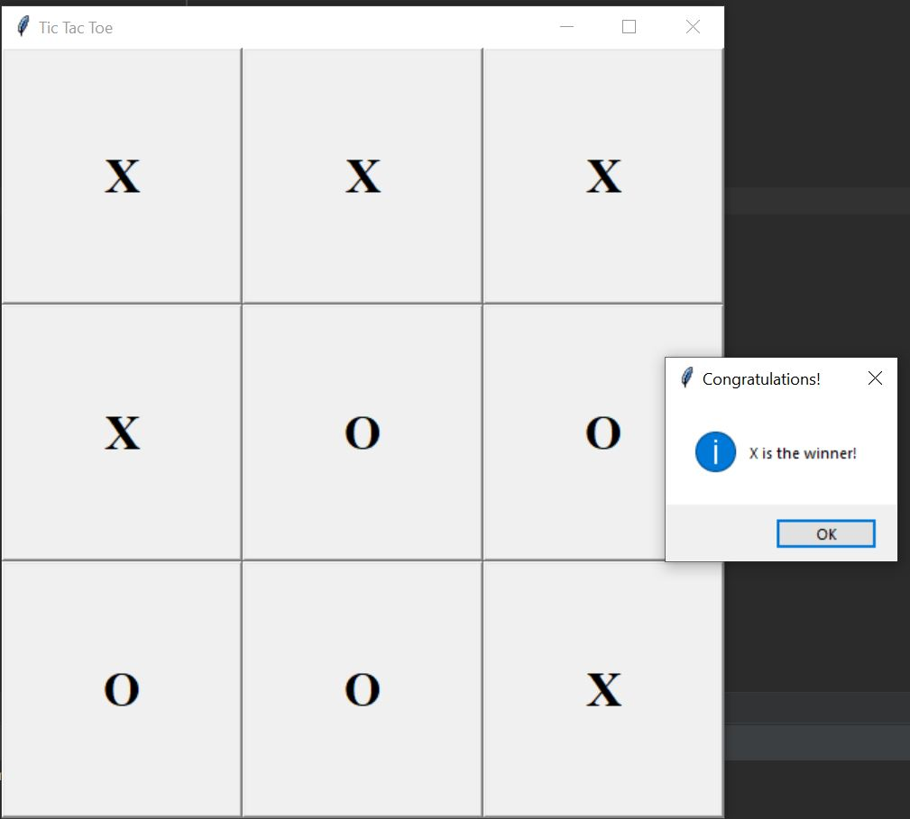

# pyTicTacToe

| **DESCRIPTION** | 

A game of TicTacToe you can play with someone else or against the computer
The python code uses tkinter GUI to help show the gameplay.
The computer has several levels of difficulty...

  - easy_comp -> Computer selects the next available empty space
  - med_comp -> Computer selects a randomly available empty space
  - hard_comp -> Computer selects the 'best' move based off the Minimax algorithm. Computer is **unbeatable**.

 

| **TECHNOLOGIES** | 
- Python
- tkinter for GUI
- Minimax Alg.

 

| **SETUP INSTRUCTIONS** |

1. Installing tkinter should be default with some installations of Python. See the [TkDocs](https://tkdocs.com/tutorial/install.html) for more info.
2. All libraries are built-in, no need to pip install, therefore should be good to run after the tkinter import. (No need for a .venv or 'requirements.txt')
3. To run, use the following terminal command...

        python3 main.py

 

| **SAMPLE IMAGES** |

